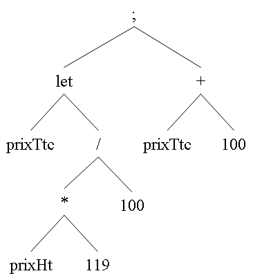

# TP Compilation : Génération d'arbres abstraits

L'objectif du TP est d'utiliser les outils JFlex et CUP pour générer des arbres abstraits correspondant à un sous ensemble du langage **λ-ada**.

## Exercice 1 :

Utiliser JFlex et CUP pour générer l'arbre abstrait correspondant à l'analyse d'expressions arithmétiques sur les nombres entiers.

Exemple de fichier source pour l'analyseur :

```
12 + 5;             /* ceci est un commentaire */
10 / 2 - 3;  99;    /* le point-virgule sépare les expressions à évaluer */
/* l'évaluation donne toujours un nombre entier */
((30 * 1) + 4) mod 2; /* opérateurs binaires */
3 * -4;             /* attention à l'opérateur unaire */

let prixHt = 200;   /* une variable prend valeur lors de sa déclaration */
let prixTtc =  prixHt * 119 / 100;
prixTtc + 100.
```

L'expression

```
let prixTtc =  prixHt * 119 / 100;
prixTtc + 100
```
pourra donner, par exemple, l'arbre suivant :



Une fois l'arbre généré, récupérez le dans le programme pricipal et affichez le, par exemple sous la forme d'une expression préfixée parenthésée :
`(; (LET prixTtc (/ (* prixHt 119) 100)) (+ prixTtc 100))`

## Exercice 2 :

Compléter la grammaire précédente en y ajoutant les opérateurs booléens, ceux de comparaison, la boucle et la conditionnelle, afin d'obtenir un sous-ensemble du langage **λ-ada** un peu plus complet.

Grammaire abstraite du sous-ensemble de λ-ada correspondant :

```
expression → expression ';' expression  
expression → LET IDENT '=' expression
expression → IF expression THEN expression ELSE expression
expression → WHILE expression DO expression
expression → '-' expression
expression → expression '+' expression
expression → expression '-' expression
expression → expression '*' expression
expression → expression '/' expression
expression → expression MOD expression
expression → expression '<' expression
expression → expression '<=' expression
expression → expression '=' expression
expression → expression AND expression
expression → expression OR expression
expression → NOT expression 
expression → OUTPUT expression 
expression → INPUT | NIL | IDENT | ENTIER
```

Le langage obtenu est tout de suite un peu plus intéressant et permet de programmer plus de choses.

Exemple de programme possible pour le sous-ensemble de λ-ada considéré ici : calcul de PGCD.

```
let a = input;
let b = input;
while (0 < b)
do (let aux=(a mod b); let a=b; let b=aux );
output a .
```
